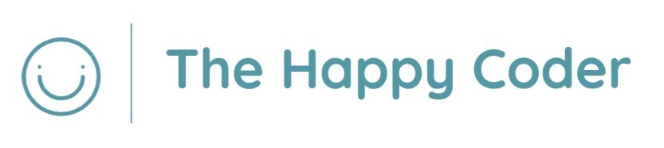

## THE HAPPY CODER
We know that in addition to getting to grips with the technical side of the School of Code, it can also be difficult to maintain a positive mindset.

To address this problem, we have created an app to promote the positive mental wellbeing of School of Code bootcampers. 

#### APP FEATURES:

⭐ `Home Page:` This contains links to useful videos/articles, covering topics such as handling imposter syndrome and managing stress. 

We have also created a 'Positivity Generator', which generates random positive affirmations at the click of a button.

⭐ `Personal Journal:` Bootcampers can use our journal feature to record and track their feelings surrounding the bootcamp. Click 'Add to Journal' to add a new entry and 'Delete' to delete an entry.

⭐ `Advice Page:` This contains helpful advice from former School of Code bootcampers.

⭐ `About Page:` You can navigate here to find further information about our team and our project.

#### TECH STACK:
- `JavaScript`
- `HTML`
- `CSS`
- `React`
- `NodeJS`
- `Express`
- `PostgreSQL`
- `JEST`
- `Heroku`

#### HOW TO RUN THE APP:

To use our app, we recommend cloning our git repositories for both frontend and backend. 

`git clone https://github.com/SchoolOfCode/w9_frontend-project-codecadets.git`

`git clone https://github.com/SchoolOfCode/w9_backend-project-codecadets.git`

You can then run npm i in each terminal to install all the necessary dependencies.

`npm i`

Finally, to view the app in the browser, run npm start on the frontend and npm run dev on the backend.

`npm start`

`npm run dev`

#### API ROUTES:

| Method | Path | Role | Response |
|---|---|---|---|
| GET	| /journal | Every journal entry | {success: true, payload: result} | 
| GET by ID	| /journal/:id | Journal matching the ID | {success: true, payload: journal} |
| POST | /journal | Create a new journal entry | {success: true, payload: result} |
| DELETE | /journal/:id |	Delete journal entry | {success: boolean, payload: string}	|

<!-- Prerequisites
We recommend using VS Code to view and run this app. You can also use other operators (whatever you prefer!)
We also advise downloading the latest version of NodeJS.
To access our code, we recommend cloning down our git repository, which we have set as public.
Once you have cloned down the repository, you can type npm i into the terminal to install all necessary dependencies including dotenv, express, nodeman and postgres.

How to access/use the webpage
Clone down the repo.
Once you've done this, open it in VS Code.
Then do npm i.
Make sure to add a .env file with the database credentials.
Find out more info about what a .env file is here: 
Then do npm run dev to run the server.

File structure:
If you look at our file structure, you'll see a number of different components. -->

#### PLANNING DOCUMENTS:

[Our Trello Board](https://trello.com/b/mYCGYhb9/)
[Our User Story](https://miro.com/app/board/uXjVOr4cxfI=/)
[Low Fidelity Wireframes](https://miro.com/app/board/uXjVOrtNm8A=/)
[High Fidelity Wireframes](https://www.figma.com/file/5Ce5gpcNI0pICCgAB19u5k/Code-Cadets---Project?node-id=0%3A1)
[Project Presentation](https://www.canva.com/design/DAFEIeqeBuM/z2wuTRlntaqPQqD8kmtrNw/edit?utm_content=DAFEIeqeBuM&utm_campaign=designshare&utm_medium=link2&utm_source=sharebutton)

#### AUTHORS:
[Omar Labban](https://github.com/olabban88)
[Bhupinder Singh](https://github.com/BhupinderSingh86)
[Nasra Saleh](https://github.com/itsnasras)
[Megan Tyson](https://github.com/megantyson)

<!-- 

code-cadets-week-9-project
https://miro.com/app/board/uXjVOr4cxfI=/
https://miro.com/app/board/uXjVOrtNm8A=/
https://www.canva.com/design/DAFEIeqeBuM/z2wuTRlntaqPQqD8kmtrNw/edit?utm_content=DAFEIeqeBuM&utm_campaign=designshare&utm_medium=link2&utm_source=sharebutton -->

 Expand to see more details

# Getting Started with Create React App

This project was bootstrapped with [Create React App](https://github.com/facebook/create-react-app).

## Available Scripts

In the project directory, you can run:

### `npm start`

Runs the app in the development mode.\
Open [http://localhost:3000](http://localhost:3000) to view it in your browser.

The page will reload when you make changes.\
You may also see any lint errors in the console.

### `npm test`

Launches the test runner in the interactive watch mode.\
See the section about [running tests](https://facebook.github.io/create-react-app/docs/running-tests) for more information.

### `npm run build`

Builds the app for production to the `build` folder.\
It correctly bundles React in production mode and optimizes the build for the best performance.

The build is minified and the filenames include the hashes.\
Your app is ready to be deployed!

See the section about [deployment](https://facebook.github.io/create-react-app/docs/deployment) for more information.

### `npm run eject`

**Note: this is a one-way operation. Once you `eject`, you can't go back!**

If you aren't satisfied with the build tool and configuration choices, you can `eject` at any time. This command will remove the single build dependency from your project.

Instead, it will copy all the configuration files and the transitive dependencies (webpack, Babel, ESLint, etc) right into your project so you have full control over them. All of the commands except `eject` will still work, but they will point to the copied scripts so you can tweak them. At this point you're on your own.

You don't have to ever use `eject`. The curated feature set is suitable for small and middle deployments, and you shouldn't feel obligated to use this feature. However we understand that this tool wouldn't be useful if you couldn't customize it when you are ready for it.

## Learn More

You can learn more in the [Create React App documentation](https://facebook.github.io/create-react-app/docs/getting-started).

To learn React, check out the [React documentation](https://reactjs.org/).

### Code Splitting

This section has moved here: [https://facebook.github.io/create-react-app/docs/code-splitting](https://facebook.github.io/create-react-app/docs/code-splitting)

### Analyzing the Bundle Size

This section has moved here: [https://facebook.github.io/create-react-app/docs/analyzing-the-bundle-size](https://facebook.github.io/create-react-app/docs/analyzing-the-bundle-size)

### Making a Progressive Web App

This section has moved here: [https://facebook.github.io/create-react-app/docs/making-a-progressive-web-app](https://facebook.github.io/create-react-app/docs/making-a-progressive-web-app)

### Advanced Configuration

This section has moved here: [https://facebook.github.io/create-react-app/docs/advanced-configuration](https://facebook.github.io/create-react-app/docs/advanced-configuration)

### Deployment

This section has moved here: [https://facebook.github.io/create-react-app/docs/deployment](https://facebook.github.io/create-react-app/docs/deployment)

### `npm run build` fails to minify

This section has moved here: [https://facebook.github.io/create-react-app/docs/troubleshooting#npm-run-build-fails-to-minify](https://facebook.github.io/create-react-app/docs/troubleshooting#npm-run-build-fails-to-minify)

